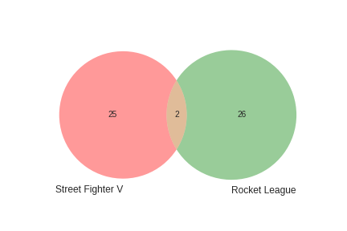

# Videogame Recommendation System
## A content based recommender system for playstation 4 games
### by Max Reinisch

This project builds a content-filter recommendation system using game metadata retrieved from [Giant Bomb's api](https://www.giantbomb.com/api/).  My original plan was build a collaborative filter by scraping review data from [Metacritic](http://www.metacritic.com/game), however the data was not robust enough to develop a reasonably successful model.  I then discovered Giant Bomb's api, and decided to use their user review data.  Unfortunately, the data I retrieved from them was not particularly robust either, however I did discover that they had a lot of game metadata that would be handy for a content filter.  

My final product is a content based recommender system that suggests similar games from a set of over 1,000 titles.  A link to the functioning flask application will be provided [here](#) once it is deployed. 

## Outline
- [Inspiration](#inspiration)
- [Overview](#overview)
- [Tools](#tools)
- [Dataset](#data)
- [Feature Extraction/Engineering](#features)
- [Building](#build)
- [Conclusion](#conclusion)

## Inspiration:
Games have been a part of my life as long as I can remember.  Some of my earliest experiences on a computer were playing point and click adventures like Spy Fox.  In middle school, I probably spent more time playing Halo and Call of Duty than doing homework.  In college, I became infactuated with indie games, playing as many as I could afford on my ramen budget, looking forward to the future when I could afford any game on my wishlist.  But now as an adult, I have found that I can't afford the time to experience the worlds I yearn to explore.  There will never be a time when I can play every game that I want, which makes the experience of playing a bad game all the more infuriating.  But there is a solution to this problem: Recommendation Systems!

## Overview:
### Problem statement:
My goal is to create a web app with a simple UI.  Given one or more games, the app will return a list of 10 "similar" games.  Since I have not played every PS4 game, there is no way for me to know if all 10 games are similar, so I my goal is that for every game that I enter, at least 1 game on the list will be a similar game that I have played.  

### Summary:
This system was trained using game data requested from Giantbomb.com's api.  The system uses features such as game concepts, developers, publishers, themes, and genres to create a binary vector for each game.  Similar games would have more overlap in their binary vectors:

#### Two Similar Games:

#### Two Different Games:

The cosine distance is calculated between every game and is saved in a pairwise table.  I then wrote a python class that interfaces with this table, allowing users to easily search one or more games at a time to get an interesting mix of results.  Finally, I wrote a web application which users can easily use.  

## Tools:

* Python
* Jupyter Notebooks
* NumPy
* Pandas
* SciKit-Learn
* MatPlotLib and Seaborn
* Flask
* HTML and Bootstrap
* [Docker image on an AWS EC2 instance](https://aws.amazon.com/) 
* [GitHub.com](https://github.com/)
* [Giant Bomb's API](https://www.giantbomb.com/api/)
* [Heroku](https://www.heroku.com/)

## Data:
You can find the notebook that requested the data [here](GB_API_Scrape/01_Getting_Data.ipynb).
You can find the documentation for accessing Giant Bomb's API [here](https://www.giantbomb.com/api/documentation#toc-0-16).

All I had to do to use the API was to get an API key.  Once I had that, I first scraped the `name` and `guid` fields for all Playstation games.  When requesting from the `games` endpoint, each response had up to 100 games, and most of the meta-data was not included. I iteratively saved each response to a file, `games_list.json`, which I would use to request each game's reviews and metadata individually. 

There are a total of 2800 ps4 games, and just under 30,000 user_reviews in GB's database.  I ran into my first obstacle when I wanted to filter my search to games that had more than 5 user-reviews. Turns out that there was a bug in the API that returned 0 user_reviews for all games, so my filter returned 0 results. So with no way of knowing how many games would be useful, I requested all reviews for all games, only to discover that there were only about 100 users who had reviewed 5 or more games. Realizing this was not enough to build a collaborative filter, I resorted to building a content filter using the game's metadata.  

I made one request for each of the 2800 games to get the metadata over a 14 hour period.  I iteratively saved each game's metadata a separate json file, identified by each game's unique `guid`.

## Features:
All my feature engineering happened in the EDA notebook [here](/02.2_Metadata_EDA.ipynb).

Having planned to do NLP on reviews for the collaborative filter, I was still hoping that I could incorperate NLP in the game descriptions.  However, once I retrieved the data, I discovered that the API response contained a field called `concepts` that contained the exact data that I wanted to extract using NLP.  I combined these `concepts` with the `genres`, `themes`, `developers`, and `publishers` features.  Each of these fields were lists of features, so I used `CountVectorizor` on each list to extract all features (so in the end I did sort of use NLP).  

At this point, I had a pandas dataframe with over 5000 features, and 1700 games.  I decided to drop a number of concepts manually, as I did not deem them relevant.  Such concepts included:
* `PAX` or `E3`, because they only state that the game had a presence at a trade show
* `Digital Distribution`, meaning that the game was downloadable
* `Trophies` and `Achievements`, because they don't relate to the actual gameplay
* `WASD Movement` and anything with `Steam`, as these features relate to computer gameplay, not playstation

I then dropped every game with less than 6 features, leaving me with just over 1000 games.  

Next, I ran 2 rounds of algorithmic feature reduction. First I ran a `VarianceThreshold` of .005, leaving me with about 1200 features.

Then I ran `TruncatedSVD` to reduce my 1200 features into 300 components.  These 300 components preserved 90% of the variance from the original features.  

The components are interesting to look at, as they are loaded with covariant features.  For any component, you can take a look at the high variance features to get an idea for what the component represents.  

For example, one component had:
* concepts_boss fight
* concepts_bosses
* concepts_health
* concepts_death
* concepts_melee

This component was very prominent in a game like Dark Souls.    

## Build:
I built the model in [this notebook](/03_Build.ipynb)

After running all of the transformations, the final step was to compute a pairwise cosine distance matrix.  The cosine distance between two vectors reflects how similar they are to each other. The cosine distance between 2 vectors in the same direction is 0.  The larger the cosine distance, the more different the vectors are. Therefore, for any given game, if we order the cosine distances from that game to every other game from smalles to largest, we will have a list of games ordered from most to least similar.  

#### Two Similar Games have a distance of 0.64:

#### Two Different Games have a distance of 0.92: 

After having done this, I decided that searching for 1 game wasn't good enough. I created a class that will take in a list of games, union their feature vector, transform the features into components, and then find the cosine distance to every other game.  The nice thing is that all you have to do is call `CustomSearch([game1, game2,...]).searchSimilarGames()`.

## Conclusion:

In conclusion, I created a matrix of cosine simularities that can be used to search for the 10 most similar games.  I then created a class to simplify the process of searching, and used html and flask to create a web app.  Through all my tests, I have found that all searches result in a game that I know to be pretty similar. 